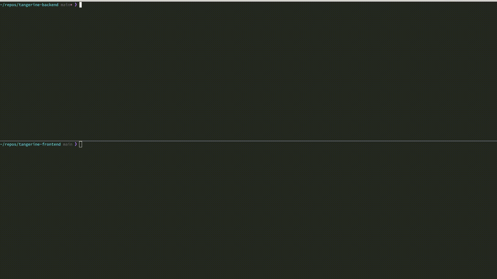

# 🍊 tangerine (frontend) <!-- omit from toc -->

- [Overview](#overview)
- [Architecture](#architecture)
- [Prerequisites](#prerequisites)
- [Development Environment Setup](#development-environment-setup)
  - [With Docker Compose](#with-docker-compose)
  - [Without Docker Compose](#without-docker-compose)
- [Development Tooling](#development-tooling)
- [Deployment](#deployment)
- [License](#license)

tangerine is a slim and light-weight RAG (Retrieval Augmented Generation) system used to create and manage chat bot assistants.

Each assistant is intended to answer questions related to a set of documents known as a knowledge base (KB).



## Overview

See the [tangerine-backend overview][tangerine-backend-overview] for an introduction.

The frontend provides a UI for managing chat bot assistants, including:

1. Assistant create/update/delete
2. Document upload
3. Chatting/interacting with an assistant

This project is currently used by Red Hat's Hybrid Cloud Management Engineering Productivity Team. It was born out of a hack-a-thon and is still a work in progress. You will find some areas of code well developed while others are in need of attention and some tweaks to make it production-ready are needed (with that said, the project _is_ currently in good enough shape to provide a working chat bot system).

Currently, the frontend is mostly used for administration purposes or local testing. The document upload interface in the UI is very rudimentary. The backend's S3 sync is the preferred method to configure assistants and indicate which documents should be uploaded.

A related plugin for [Red Hat Developer Hub][rhdh] can be found [here][backstage-plugin] which is the frontend end-users interact with.

## Architecture

For a detailed breakdown of the tech stack, component structure, and data flow, see [ARCHITECTURE.md][architecture].

## Prerequisites

- **Node.js 22+** (matches the Node 22 UBI9 container image used in production)
- **npm** (bundled with Node.js)
- A running [tangerine-backend][tangerine-backend] instance

## Development Environment Setup

A development environment can be set up with or without Docker Compose.

### With Docker Compose

> **_NOTE:_** Not supported on Mac, see [Without Docker Compose](#without-docker-compose) below.

1. First, refer to the backend setup guide [here][tangerine-backend-docker-compose].

2. Once the backend is up and running, start the frontend:

   ```text
   docker compose up --build
   ```

3. You should then be able to reach the frontend at `http://localhost:3000`

### Without Docker Compose

1. First, refer to the backend setup guide [here][tangerine-backend-no-docker].

2. Once the backend is up and running, install the frontend:

   ```text
   npm install
   ```

3. Then start a development server:

   ```text
   npm start
   ```

4. You should then be able to reach the frontend at `http://localhost:3000`

## Development Tooling

The following commands are available for linting, formatting, type-checking, and testing:

| Command                | Description                              |
| ---------------------- | ---------------------------------------- |
| `npm run lint`         | Run ESLint across the project            |
| `npm run lint:fix`     | Run ESLint and auto-fix violations       |
| `npm run format`       | Format all files with Prettier           |
| `npm run format:check` | Check formatting without writing changes |
| `npm run typecheck`    | Run TypeScript type-checking (tsc)       |
| `npm test`             | Run Jest tests                           |

Pre-commit hooks automatically run ESLint (with `--fix`), Prettier (with `--write`), JSON/YAML
validation, and Jest tests (with `--passWithNoTests`) before each commit.

## Deployment

The frontend is containerized and published to [quay.io/app-sre/tangerine-frontend][quay-image].
To build and push the image, run:

```text
QUAY_USER=<your-user> QUAY_TOKEN=<your-token> ./build.sh
```

## License

This project is licensed under the [Apache License 2.0][license].

[tangerine-backend]: https://github.com/RedHatInsights/tangerine-backend
[tangerine-backend-overview]: https://github.com/RedHatInsights/tangerine-backend#overview
[tangerine-backend-docker-compose]: https://github.com/RedHatInsights/tangerine-backend#with-docker-compose
[tangerine-backend-no-docker]: https://github.com/RedHatInsights/tangerine-backend#without-docker-compose
[rhdh]: https://developers.redhat.com/rhdh/overview
[backstage-plugin]: https://github.com/RedHatInsights/backstage-plugin-ai-search-frontend
[quay-image]: https://quay.io/repository/app-sre/tangerine-frontend
[license]: LICENSE
[architecture]: ARCHITECTURE.md
